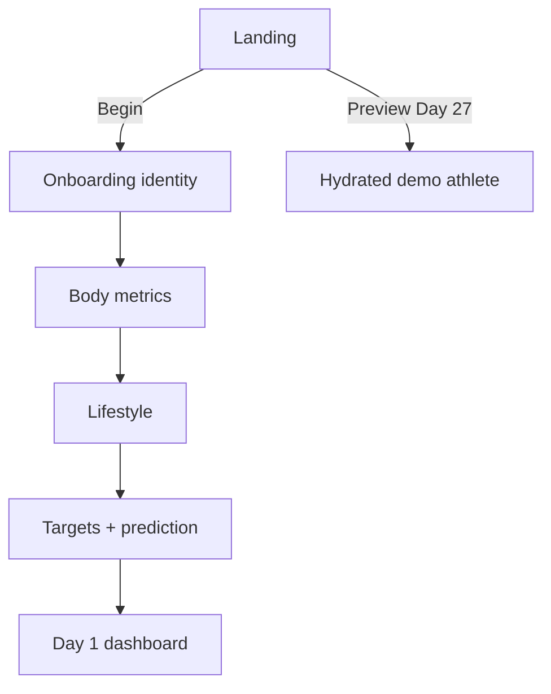
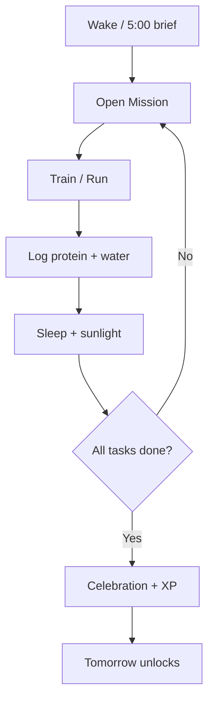

# User Flows

## First-run



## Daily operating loop



## Coach adjustment

```mermaid
flowchart LR
  U[User message] --> API[/api/coach]
  API -->|OPENAI_API_KEY| O[OpenAI]
  API -->|missing key| L[Local rule engine]
  O --> R[Supportive action]
  L --> R
```

## Lock rule

Tomorrow is a locked node until `missions[currentDay].tasks.every(completed)`. Completing the day increments streak, grants 100 XP, and generates the next workout.
